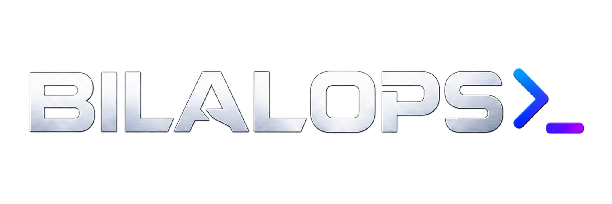

  

  <h3>Software Development • Cybersecurity • Privacy-Focused Tools</h3>
  
Secure, practical and automation-driven digital solutions.

  
  

---

### 👋 About BilalOps

BilalOps develops secure web tools, automation systems and privacy-focused software.  
The goal is simple: turn complex technical problems into reliable, usable solutions.

- 🔐 Cybersecurity, Red Team & Blue Team
- 💻 Web application and software development
- 🤖 Automation, bots and workflow systems
- 🕵️ OSINT and digital investigation
- 🛡️ Data privacy and metadata protection
- 📍 Şanlıurfa, Türkiye

### 🚀 Featured Project

#### [Media Privacy & Metadata Cleaner](https://bilalops.com.tr/tools/media-privacy)

A browser-based privacy tool designed to remove EXIF, XMP and AI-related metadata from images before sharing them online.

### 🧰 Technologies & Focus

  
  
  
  
  
  

### 🤝 Work With BilalOps

For software development, cybersecurity and custom automation projects:

🌐 **[bilalops.com.tr](https://bilalops.com.tr)**

---

  <strong>Build securely. Automate intelligently. Protect privacy.</strong>

